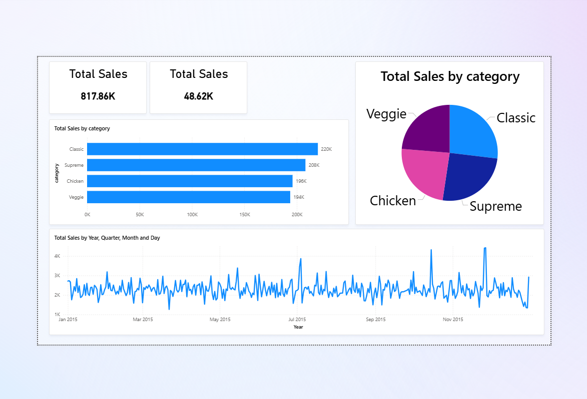

# 🍕 Pizza Sales Analysis – Power BI

# Project Overview
This project is a Power BI dashboard built to analyze pizza sales data ,
It focuses on practicing data analysis, data modeling, and visualization skills.

## Key Insights
- Overall sales performance and total revenue
- Total number of orders
- Sales distribution by pizza category
- Sales trends over time (Year, Month, Day)

# Tools & Technologies
- Power BI
- DAX Measures
- Data Modeling
- Data Visualization

## Dashboard Preview
Below is a preview of the Power BI dashboard created in this project:

# Files Included
- `Sales Data Analysis.pbix` → Power BI dashboard file
- `README.md` → Project documentation

# Purpose
This project is part of my self-learning journey to improve my data analysis and Power BI skills.
